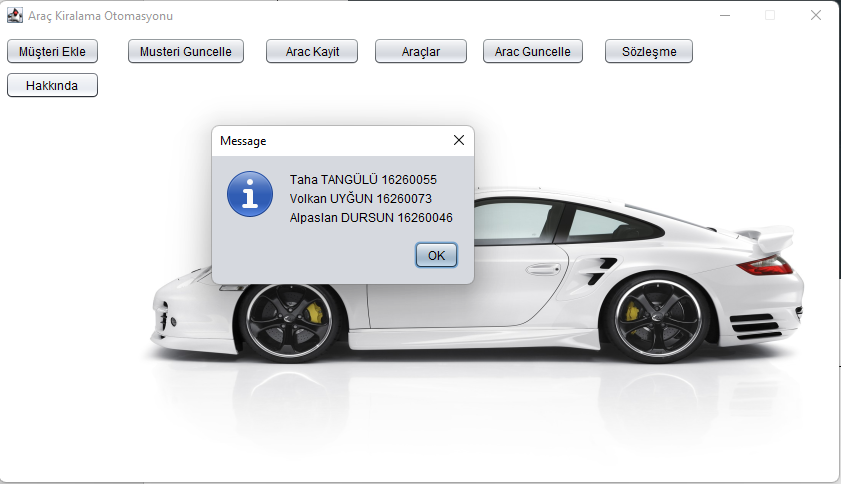
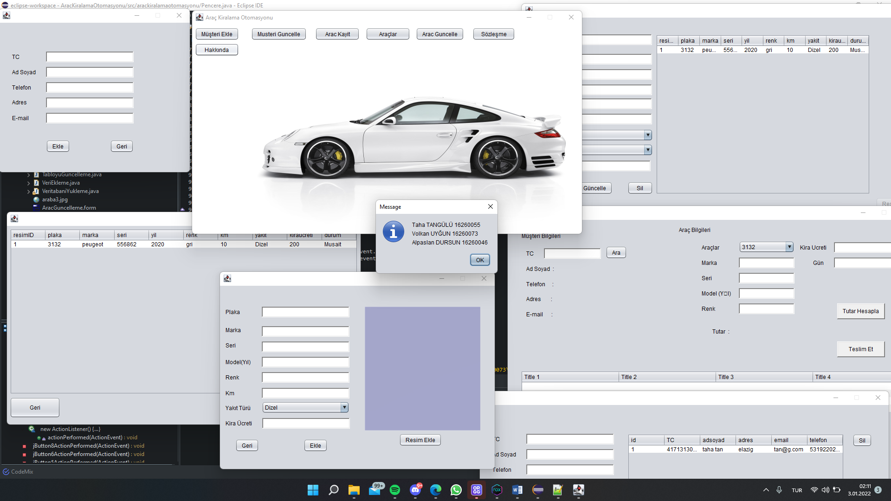
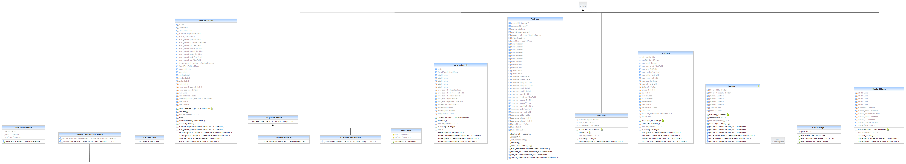
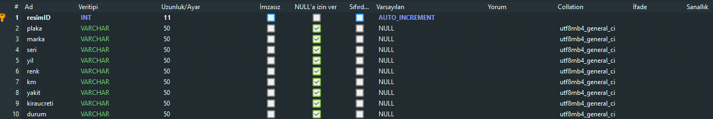
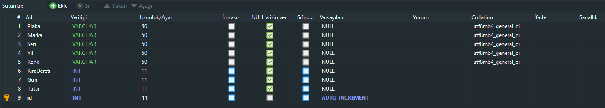

# BilMuhTasarimi
## ARAÇ KİRALAMA OTOMASYONU
 
**Volkan UYĞUN 16260073**

**Alpaslan DURSUN 16260046**

**Taha TANGÜLÜ 16260055**

**Projenin Başlatılma Gerekçesi (Özet)**
	
Gelişen dünyada artan araç ihtiyaçlarında müşteri memnuniyetini sağlamak ve onlar için maddiyatta uygun yollar izlemek. 
Müşteri ile aramızda bir bağ oluşturmak. Fiyat ve kaliteyi birlikte sunabilmektir. Günümüzde herkesin artık lüksten çok ekonomik ve kullanışlı şeylere yönelmesi ile uygun fiyatlı ve kullanışlı hizmet verilebilmektir.

**Proje İçinden Görseller**

> Program içi görsel 1

> Program içi görsel 2

> UML Diagramı

> Veri Tabanı görsel 1

> Veri Tabanı görsel 2

> Veri Tabanı görsel 3

**[Proje dosyamıza direkt ulaşmak için tıklayınız.](OdevKonusu.docx)**
**[SQL dosyamıza direkt ulaşmak için tıklayınız.](arackiralamal.sql)**
